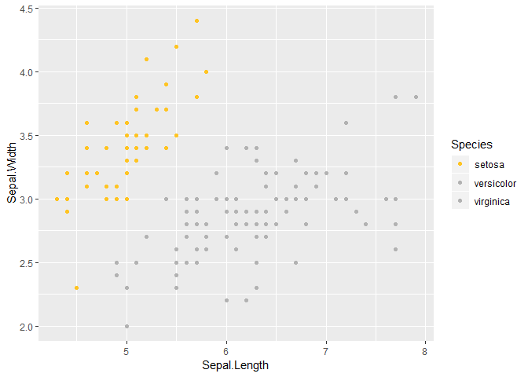

<!-- README.md is generated from README.Rmd. Please edit that file -->
redbull
=======

The goal of redbull is to provide helper functions for Data Scientist teams at Red Bull.

``` r
ggplot(data = iris, aes(x = Sepal.Length, y = Sepal.Width, colour = Species)) + geom_point() + scale_color_redbull("rbyellowgrey")
```


