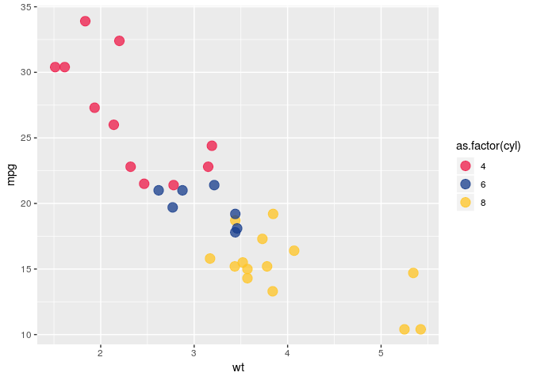

redbull
=======

The `redbull` package contains `ggplot2` colour themes for use in Red Bull Data Science projects.

Installation
------------

You can install `redbull` from github with:

``` r
# You need to install the 'devtools' package first
devtools::install_github("deathbydata/redbull")
```

The Palettes
------------

There are several colours and palettes built in to the package. Additions and modifications are welcomed! See the [`palettes.R`](/R/palettes.R) file for the details.

-   `redbull` (default)
-   `rbfull`
-   `rbcool`
-   `rbwarm`
-   `rbyellowgrey`
-   `bloomberg`
-   `bloombergfull`

Usage
-----

Usage is through the functions `scale_fill_redbull` and `scale_colour_redbull` depending on your plot aesthetic.

``` r
library(ggplot2)
```

    ## Warning: package 'ggplot2' was built under R version 3.5.2

``` r
library(redbull)
library(magrittr)

theme_set(theme_bw())

# Using colour aesthetic (points/lines)
mtcars %>% 
  ggplot(aes(x = wt, y = mpg, colour = as.factor(cyl))) + 
  geom_point(size = 4, alpha = 0.75) + 
  scale_colour_redbull()
```



``` r
# Using fill aesthetic (bars/areas)
mtcars %>% 
  ggplot(aes(x = as.factor(carb), fill = as.factor(carb))) + 
  geom_bar() + 
  scale_fill_redbull("rbfull")
```


You can use `discrete = FALSE` if you have continuous values. `reverse = TRUE` will flip the direction of the colours in the palette.

``` r
mtcars %>% 
  ggplot(aes(x = disp, y = wt, colour = hp)) + 
  geom_point(size = 4.5, colour = "black") +
  geom_point(size = 4) + 
  scale_color_redbull("rbwarm", discrete = FALSE, reverse = TRUE) +
  ggtitle("Relationship between engine weight and displacement",
          "Colour shows engine horsepower") +
  xlab("Engine displacement (cc)") +
  ylab("Engine weight (?)")
```


For discrete scales you can select the behaviour when there are more levels of your factor than palette colours using the `rep` parameter.

``` r
mtcars %>% 
  ggplot(aes(x = as.factor(carb), fill = as.factor(carb))) + 
  geom_bar() + 
  scale_fill_redbull("rbyellowgrey", rep = TRUE)
```


``` r
mtcars %>% 
  ggplot(aes(x = as.factor(carb), fill = as.factor(carb))) + 
  geom_bar() + 
  scale_fill_redbull("rbyellowgrey", rep = FALSE)
```


